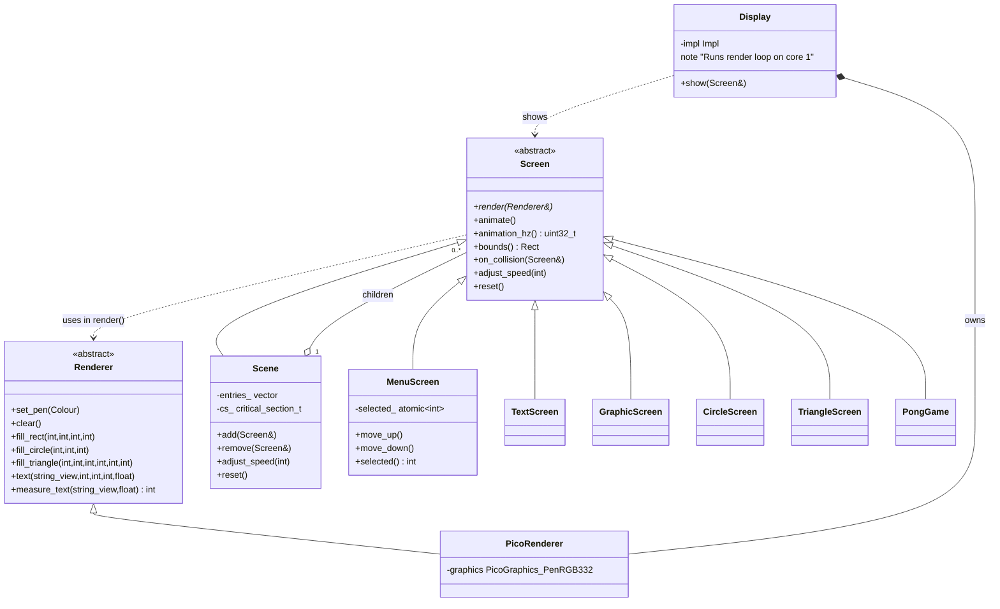

# pico_exp1

A playground repo for the Raspberry Pi Pico W + [Pimoroni Pico Explorer](https://shop.pimoroni.com/products/pico-explorer-base) board, written in C++ and built hand-in-hand with [Claude](https://claude.ai) as a collaborative coding experiment.

The goal isn't production code — it's a space to explore embedded C++ ideas, try things out, and see what emerges when you pair a human with an AI on a small hardware project.

## Hardware

- Raspberry Pi Pico W
- Pimoroni Pico Explorer Base (240×240 ST7789 display, 4 buttons, breadboard)
- Raspberry Pi Debug Probe (for flashing via SWD — no BOOTSEL juggling)

## What it does

Boots to a menu with two options.

### Bouncing Demo

A rectangle, circle, and text bounce around the screen, collide with each other, and react.

| Button | Action |
|--------|--------|
| A | Speed up all objects |
| B | Slow down all objects |
| X | Add a triangle (random colour) |
| Y (short press) | Remove a random triangle |
| Y (hold 5s) | Back to menu (resets demo) |

### Pong

Two-player pong with a bouncing ball and sound effects.

| Button | Action |
|--------|--------|
| A (held) | Left paddle up |
| B (held) | Left paddle down |
| X (held) | Right paddle up |
| Y (held) | Right paddle down |
| Y (hold 5s) | Back to menu |

**Sound:** bounce sounds play via the onboard piezo. Bridge **GP0** to the **AUDIO** header pin on the Pico Explorer to enable it.

## Architecture

The code is structured around a small rendering abstraction:

- **`Screen`** — base class for anything that can be rendered and animated
- **`Renderer`** — interface that hides PicoGraphics behind plain draw calls
- **`Scene`** — composite screen: owns a list of child screens, clears once, renders all children, handles per-child animation timing and collision detection
- **`Display`** — PIMPL class that runs the 30 Hz refresh loop on core 1, accepts a `Screen&` to display

All Pimoroni/PicoGraphics headers are confined to `display.cpp`. The rest of the code has no hardware dependencies.



## Building

One-time setup (Fedora — installs toolchain, clones SDKs, builds picotool):

```bash
bash setup.sh
```

Incremental builds:

```bash
cmake --build build -j$(nproc)
```

## Flashing

Connect the Raspberry Pi Debug Probe to the Pico W's SWD port, then:

```bash
bash flash.sh
```

No BOOTSEL button required.

## Project structure

```
display.cpp/hpp        — Display class (PIMPL, core 1 render loop)
renderer.hpp           — Abstract Renderer interface
screen.hpp             — Abstract Screen base class + Rect
scene.cpp/hpp          — Composite scene with collision detection
text_screen.cpp/hpp    — Bouncing text
graphic_screen.cpp/hpp — Bouncing rectangle
circle_screen.cpp/hpp  — Bouncing circle
triangle_screen.cpp/hpp — Bouncing triangle (dynamically added/removed)
menu_screen.cpp/hpp    — Simple menu with keyboard navigation
pong_game.cpp/hpp      — Self-contained Pong game
buzzer.cpp/hpp         — Non-blocking PWM tone generator (GP0)
screen_dims.hpp        — Shared display dimensions
hello_world.cpp        — main(): app state machine and button handling
```
