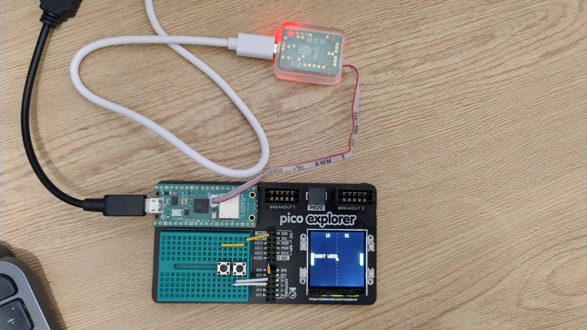
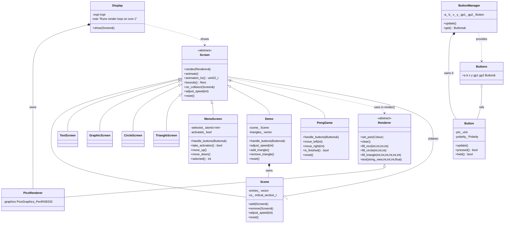

# pico_pico_explorer

A playground repo for the Raspberry Pi Pico W + [Pimoroni Pico Explorer](https://shop.pimoroni.com/products/pico-explorer-base) board, written in C++ and built hand-in-hand with [Claude](https://claude.ai) as a collaborative coding experiment.

The goal isn't production code — it's a space to explore embedded C++ ideas, try things out, and see what emerges when you pair a human with an AI on a small hardware project.

## Hardware

- Raspberry Pi Pico W
- Pimoroni Pico Explorer Base (240×240 ST7789 display, 4 buttons, breadboard)
- Two extra buttons wired on the breadboard: **GP1** (back) and **GP2** (select), active-high with pull-downs
- Raspberry Pi Debug Probe (for flashing via SWD — no BOOTSEL juggling)



## What it does

Boots to a menu. Navigate with A/X (up) and B/Y (down), select with GP2, or go back to the menu from any app with GP1.

### Bouncing Demo

A rectangle, circle, and text bounce around the screen, collide with each other, and react.

| Button | Action |
|--------|--------|
| A | Speed up all objects |
| B | Slow down all objects |
| X | Add a triangle (random colour) |
| Y | Remove a random triangle |
| GP1 | Back to menu (resets demo) |

### Pong

Two-player pong with a bouncing ball and sound effects. First to 15 wins.

| Button | Action |
|--------|--------|
| A (held) | Left paddle up |
| B (held) | Left paddle down |
| X (held) | Right paddle up |
| Y (held) | Right paddle down |
| GP1 | Back to menu |

**Sound:** bounce sounds play via the onboard piezo. Bridge **GP0** to the **AUDIO** header pin on the Pico Explorer to enable it.

## Architecture

The code is structured around a small rendering abstraction:

- **`Screen`** — base class for anything that can be rendered and animated
- **`Renderer`** — interface that hides PicoGraphics behind plain draw calls
- **`Scene`** — composite screen: owns a list of child screens, clears once, renders all children, handles per-child animation timing and collision detection
- **`Display`** — PIMPL class that runs the 30 Hz refresh loop on core 1, accepts a `Screen&` to display
- **`Button`** — wraps a single GPIO pin; handles pull direction, debouncing via edge detection, and `pressed()`/`held()` queries
- **`ButtonManager`** — owns all six `Button` objects with their pin/polarity config; exposes `update()` and a `Buttons` aggregate for passing to handlers
- **`Demo`** / **`PongGame`** — self-contained apps that implement `Screen` and own their own `handle_buttons()` logic

All Pimoroni/PicoGraphics headers are confined to `display.cpp`. The rest of the code has no hardware dependencies.



## Building

One-time setup (Fedora — installs toolchain, clones SDKs, builds picotool):

```bash
bash setup.sh
```

Incremental builds:

```bash
cmake --build build -j$(nproc)
```

## Flashing

Connect the Raspberry Pi Debug Probe to the Pico W's SWD port, then:

```bash
bash flash.sh
```

No BOOTSEL button required.

## Project structure

```
main.cpp                   — app state machine; defers button handling to each app
lib/
  screen.hpp               — abstract Screen base class + Rect
  renderer.hpp             — abstract Renderer interface
  screen_dims.hpp          — shared display dimensions
  display.cpp/hpp          — Display class (PIMPL, core 1 render loop)
  scene.cpp/hpp            — composite scene with animation timing and collision detection
  button.cpp/hpp           — Button class (single GPIO, pressed/held edge detection)
  button_manager.cpp/hpp   — ButtonManager (owns all buttons, pin/polarity config)
  text_screen.cpp/hpp      — bouncing text
  graphic_screen.cpp/hpp   — bouncing rectangle
  circle_screen.cpp/hpp    — bouncing circle
  triangle_screen.cpp/hpp  — bouncing triangle (dynamically added/removed)
  menu_screen.cpp/hpp      — menu with navigation and selection
  buzzer.cpp/hpp           — non-blocking PWM tone generator (GP0)
apps/
  demo.cpp/hpp             — bouncing demo app
  pong_game.cpp/hpp        — two-player Pong
```
